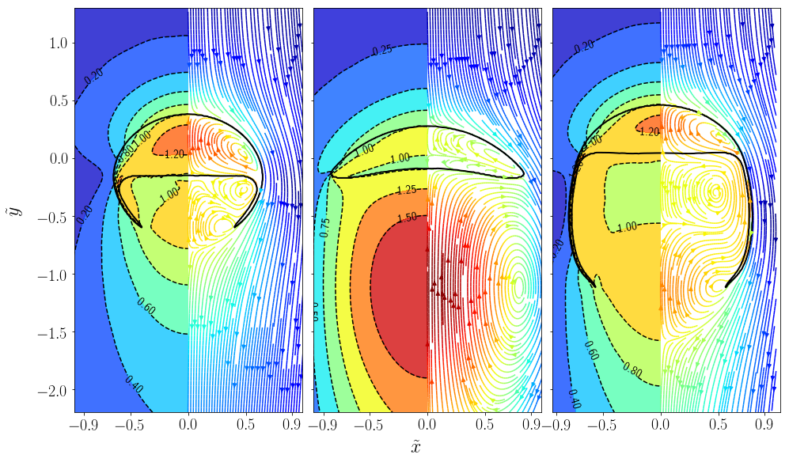

# Basilisk volume-of-fluid (VoF)-based flow solver

This repository contains the source code and scripts to simulate an axis-symmetric rising bubble in [Basilisk](http://basilisk.fr/). The solver was used to create the Basilisk simulations described in the PhD thesis:
```
Modeling and simulation of convection-dominated species transfer at rising bubbles
```
This project was funded by the German Reseach Foundation (DFG) within the priority program [SPP1740 Reactive Bubbly Flows](http://www.dfg-spp1740.de/) under the grand *BO 1879/13-2*. The work was supervised by [Prof. Dr. rer. nat. Dieter Bothe](mailto:bothe@mma.tu-darmstadt.de) and conducted at the [Institute for Mathematical Modeling and Analysis](https://www.mma.tu-darmstadt.de/index/index.en.jsp) at the Technical University of Darmstadt.

The solver is based on the Basilisk test cases
- [bubble.c](http://basilisk.fr/src/examples/bubble.c)
- [rising.c](http://basilisk.fr/src/test/rising.c)
- [the sandbox of acastillo](http://basilisk.fr/sandbox/acastillo/readme) (VTK support)

## Dependencies

To make the simulation results reproducible, a Docker image with a pre-configured Basilisk installation has been created. The Dockerfile is available in a separate [repository](https://github.com/AndreWeiner/basilisk_docker). Any installed version of [Docker](https://docs.docker.com/install/) greater than **1.10** will be able to pull and execute the Docker image hosted on [Dockerhub](https://hub.docker.com/r/andreweiner/basilisk). There are convenience scripts to create and start a Docker container which require root privileges. To avoid running the scripts with *sudo*, follow the [post-installation steps](https://docs.docker.com/install/linux/linux-postinstall/).

The convenience script *createContainer.sh* by default pulls the image tagged with **20-11-19**, which stands for the 20th of November 2019 (the creation date of the image).

## Starting a simulation

If not already done, clone this repository using Git or by clicking the *Download* button.

```
git clone https://github.com/AndreWeiner/phd_basilisk.git
cd phd_basilisk
```
To pull the Basilisk image and to create a container with suitable settings, run:

```
./createContainer.sh
```
The script has to be executed **only once** on a fresh installation/workstation. By default, the user executing the script is also mapped into the container. This setting ensures that output files have the the right owner. If you execute the script as root, e.g. by using *sudo*, then all files belong to the root user. However, you can change the ownership afterwards with [chown](https://askubuntu.com/questions/693418/use-chown-to-set-the-ownership-of-all-a-folders-subfolders-and-files/693423). To compile the solver contained in the *solver* directory, run:

```
./startContainer.sh
# inside the container
cd solver
make
```
From within the container, create a *run* directory and execute the solver:
```
# continuing from the previous code-box
cd ..
mkdir run
cd run
mpirun -np 4 $HOME/solver/bubble 13 2.0 200.0 &> log.bubble
```
The code-block above executes the solver with 4 MPI processes (-np 4). The command-line arguments can be used to create different refinement levels and physical conditions:

- the first argument is an integer value defining the maximum allowed **refinement level**
- the second argument is a double defining the **Bond/Eotvos number** (*Eo*)
- the third argument is a double defining the **Galilei number** (*Ga*)

Some results for different combinations of *Eo* and *Ga* are depicted hereafter. *Eo*/*Ga* from left to right are 243/80, 115/135, 339/30.8, and the resulting shapes are usually referred to as dimpled ellipsoidal, spherical cap, and skirted bubbles. The scripts to generate such visualizations can be found [here](https://github.com/AndreWeiner/phd_notebooks/blob/master/notebooks/basilisk_2D_velocity_field.ipynb).



For more information about the setting, follow the links at the beginning of this document.

## Native builds

Sometimes it can be necessary to create native builds, for example, to run the solver on HPC resources. The Basilisk compiler *qcc* allows to create a single source file containing the entire solver functionality. The resulting source, e.g. *_bubble_axis_symmetric.c*, can be moved to and compiled on the target platform. A typical workflow looks like:

```
# start a bash shell in the container
./startContainer
cd solver
make native
# logout to get back to the host machine
exit
scp solver/_bubble_axis_symmetric.c user_name@hpc.address.com:/home/user_directory/
# log in on the cluster and load gcc/openmpi modules
mpicc -Wall -O2 _bubble_axis_symmetric.c -o bubble -lm -lmpi
```
The Docker container employs

- openMPI 1.10.2
- gcc 5.4.0

to compile and run the code. However, there is some flexibility regarding the compatibility between various versions of each component. If the linker has trouble to find the MPI shared object libraries, append the *-I/path/to/mpi/** option to the compile-command above.

## Trouble shooting

If you have technical questions regarding the compilation or execution, feel free to use the [issue tracker](https://github.com/AndreWeiner/phd_basilisk/issues) of this repository. Some known problems are listed below:

- *mpirun* display the warning **Unexpected end of /proc/mounts line**; this issue can be fixed by moving to a newer version of openMPI >= 3.0; see [this post](https://stackoverflow.com/questions/46138549/docker-openmpi-and-unexpected-end-of-proc-mounts-line) on Stackoverflow; native builds are not affected since this issue is related to Docker

## How to reference

This repository accompanies the following publication:
```
@phdthesis{tuprints11405,
            year = {2020},
         address = {Darmstadt},
          school = {Technical University of Darmstadt, Mathematical Modeling and Analysis},
          author = {Andre Weiner},
           title = {Modeling and simulation of convection-dominated species transfer at rising bubbles},
           month = {February},
            url = {http://tuprints.ulb.tu-darmstadt.de/11405/}
}
```
